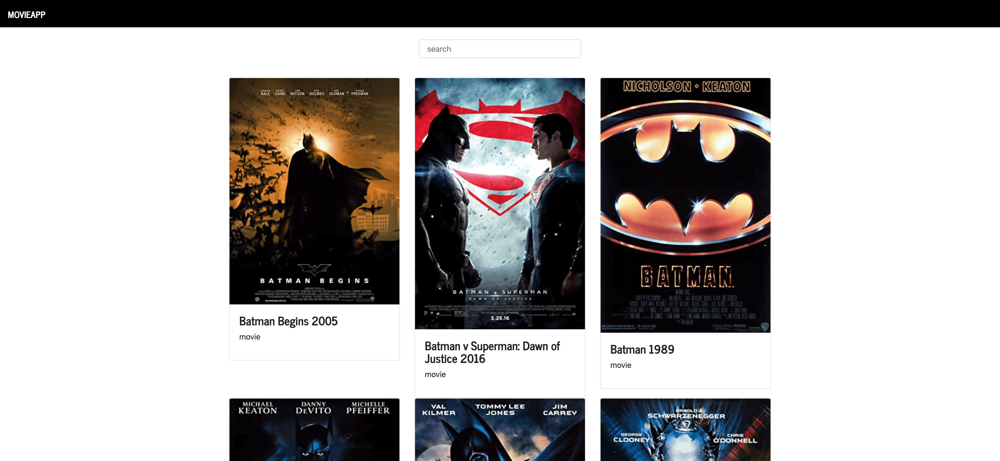

## APP show movies with react

state full class components

-- technologies
React
Webpack
Sass
eslint

## Cómo funciona?

Requiere nodeJs

- `npm install` para instalar las dependencias.
- `npm run start` para el entorno de desarrollo.

## Licencia

MIT
